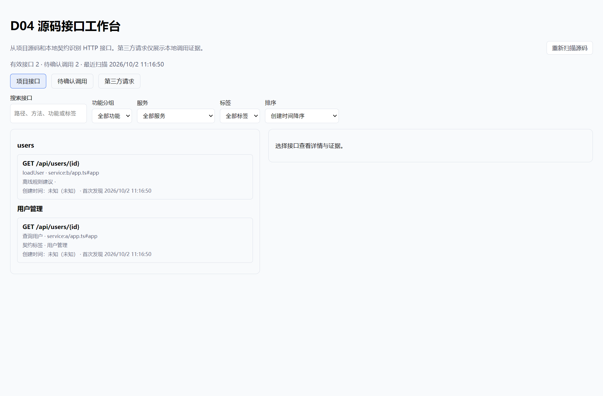

# V2-D04 源码接口索引与工作台执行记录

日期：2026-10-02；环境：Windows、PowerShell 7.6、Node v24.21.0。状态：**已实现待验收**。

本次读取当前任务文档的通用规则、D01/D04 卡、PRD §6、公共接口契约和相关 memory。保留工作区已有及并行任务修改，没有提交、推送、部署或真实付费调用。

## 依赖核验

D01 在当前任务表中仍为“待办”。已核实既有 Git 导入及 `code-root` 指针可供 D04 使用，外置源码根的扫描和只读导航已有测试。执行期间出现文件夹/ZIP/统一识别的并行修改，但其未完成的任务状态和未验收链路不能充当 D01 已完成证据。D04 对已登记代码根可用；D01 文件夹/普通 ZIP 接入后完整流程仍需联验。

## 交付内容

- `packages/registry/src/api-index/` 使用现有 TypeScript AST 入口及 Python tokenizer，新增 Express、Nest、FastAPI 显式 HTTP 声明和 JS/TS fetch/axios 调用扫描。Service 方法只作为实现线索。解析相对模块、静态挂载前缀、参数路径、axios baseURL 和静态 Vite 代理；不加载或执行工程模块。
- 本地 OpenAPI 复用 `packages/preview/src/mock/openapi-loader.ts`，补充参数、认证、server 和 HEAD/OPTIONS 元数据。按公共 `serviceId + method + normalizedPath` 路由身份合并声明/契约；不同服务同路径不会合并。
- `0009_api_index.sql` 持久化接口、调用、关系和扫描元数据。使用稳定 endpointId、源码证据、版本、人工覆盖、失效指纹和路由历史；删除对象/关系保留历史，退出有效导航。扫描不完整保留旧对象并标待确认/失效，禁止使用过期证据确认关系。
- 通过已有 nav 域及 shell-api 白名单提供异步列表、重扫、详情、人工分类、关系确认和正反向导航。Electron 与 Tauri 共享异步消费端口；renderer 的浏览器入口只导出类型/排序，不引入 AST、Node 或 SQLite 运行依赖。
- `/apis` 工作台提供功能分组、搜索、服务/标签筛选、未分类、创建时间升降序、最近修改、待确认调用和第三方请求。详情包括参数/响应/认证线索、证据及置信度、实现位置、调用方、锚点元素、测试/文档线索和时间说明；人工分类/标签可保存、恢复自动建议并在重扫后保留。
- 接口证据可进入现有只读代码页面，代码行 Ctrl/Meta 点击可反查接口。已有元素锚点复用原导航入口。源码阅读支持登记的外置代码根，校验目录穿越和链接。

## 逐项验收

| 需求/边界                      | 实际结果与证据                                                                                                                                                                                                 |
| ------------------------------ | -------------------------------------------------------------------------------------------------------------------------------------------------------------------------------------------------------------- |
| V2-API-01：声明/调用索引和前缀 | Express 多级跨文件挂载、CommonJS Router/route 链、Nest 全局/Controller 前缀、FastAPI include_router；多个 fetch 调用点；Service 方法未成为 HTTP 接口。固定夹具通过。                                           |
| V2-API-02：服务和未解析关系    | 同路径多服务保持独立；本地 OpenAPI 多 server、axios 导入实例/baseURL、静态代理关联；动态 URL/方法/环境变量/挂载/代理 rewrite 留待确认，原表达式可见。动态 server 不合并有效路由。                              |
| V2-API-03：分类/人工覆盖       | 用户覆盖优先于契约 tag、功能名称匹配和路径规则；保存检查版本，重扫保留覆盖。功能、服务、标签和搜索可用。未启用收费 AI 分类。                                                                                   |
| V2-API-04：时间                | 真实本地 Git 验证首次可追溯声明推断；无 Git/父仓库/浅克隆/未提交路由/文件重命名降级未知并说明。已知时间之后放未知项，未知按 firstSeenAt/ID 排序。mtime 仅展示为文件修改时间。                                  |
| V2-API-05：详情/双向导航       | 参数、响应、认证、证据、调用和实现线索可见；生产源码正向导航及 Ctrl 点击反向导航通过真实 Electron UI/IPC。锚点元素使用已有导航。测试/文档引用明确为线索，不声称执行覆盖。                                      |
| 人工关系与删除历史             | 动态调用可人工指定；证据未变化重扫保留，表达式/路由改变要求重新确认。删除接口/调用保留历史关系，关系 inactive，不继续进入有效 API 图。                                                                         |
| 源码/外部边界                  | API 索引路径无网络 fetch，受测 fetch spy 未被调用；真实 E2E 断言源码内容未改。跳过 .env、依赖、构建输出及链接；仅扫描登记代码根内本地文件，没有执行项目脚本、解析远端 `$ref`、探测外部 API 或自动补 Git 历史。 |
| V2-E2E-07/08 对应 D04 浏览链路 | 真实 Electron BrowserWindow → preload → IPC → nav/code 生产域 → SQLite；源码索引、人工分类、重扫保留、关系确认、第三方分区、正反向导航、源码只读八项结果全部为 true。D09 的增删生成流程不在本卡范围。          |

## 实际检查

| 检查                                                     | 结果                                                                                                                                                                                                       |
| -------------------------------------------------------- | ---------------------------------------------------------------------------------------------------------------------------------------------------------------------------------------------------------- |
| D04 专项（scanner、生产 SQLite/RPC、本地 Git、工作台）   | 3 文件 / 24 项通过。                                                                                                                                                                                       |
| D04 真实 Electron E2E                                    | 1 文件 / 1 项通过；最终修改后复验成功。                                                                                                                                                                    |
| 原生窗口操作                                             | 用 computer-use 操作本次验收窗口：点击重扫清除失效提示且保留人工分组，点击接口详情确认“未知创建时间/首次发现/文件修改时间”区分；窗口已关闭。                                                               |
| 扩展回归：AST/OpenAPI/迁移/生产端口/代码阅读/命令/白名单 | 最新 12 文件 / 150 项：148 通过、2 失败，失败位置见下文；早期快照 145 项全部通过不能替代当前结果。                                                                                                         |
| lint 与变更文件格式                                      | D04 新增及相关变更源码/测试 ESLint `--max-warnings 0`、新增文件 Prettier 检查通过；仅格式化变更文件，未全仓格式化。早期 `git diff --check` 通过，最后快照共享 code-domain/README 出现并行修改的 EOF 空行。 |
| 类型检查                                                 | registry、shell-api 当前单独检查通过；renderer/desktop/preview/e2e 跨包检查受其他修改影响未全部通过，见下文。                                                                                              |
| 构建                                                     | Electron main、preload、共享 Node 侧车构建通过；D04 浏览器工作台通过真实 E2E esbuild 打包。整站 Vite 构建未通过，见下文。未构建安装包或宣称双壳发行验收。                                                  |

D04 专项命令（仓库根）：

```powershell
node node_modules/vitest/vitest.mjs run packages/registry/src/__tests__/api-index.test.ts apps/desktop-electron/src/main/__tests__/api-index.test.ts apps/renderer/src/features/api-index/__tests__/api-workbench.test.tsx --no-file-parallelism
node node_modules/vitest/vitest.mjs run -c e2e/vitest.config.ts e2e/domain/e2e-28-api-index.test.ts --no-file-parallelism
```

扩展回归命令（与专项重叠，不能累加为独立通过总数）：

```powershell
node node_modules/vitest/vitest.mjs run packages/registry/src/__tests__/api-index.test.ts packages/registry/src/__tests__/ast-parsers.test.ts packages/preview/src/__tests__/openapi-loader.test.ts packages/data/src/__tests__/migrator.test.ts apps/desktop-electron/src/main/__tests__/api-index.test.ts apps/desktop-electron/src/main/__tests__/domain-run-ports.test.ts apps/renderer/src/features/api-index/__tests__/api-workbench.test.tsx apps/renderer/src/runtime/__tests__/api-index-port.test.ts apps/renderer/src/runtime/__tests__/production-ports.test.ts apps/renderer/src/features/code/__tests__/code-view.test.tsx apps/renderer/src/__tests__/command-catalog.test.ts packages/shell-api/src/__tests__/domain-control.test.ts --no-file-parallelism
```

类型检查实际使用 `node node_modules/typescript/bin/tsc -p <包>/tsconfig.json --noEmit`，包包括 apps/renderer、apps/desktop-electron、packages/registry、packages/preview、packages/shell-api 和 e2e。构建在各 app 目录使用现有 Vite/esbuild 命令及 `node scripts/build-sidecar.mjs`；侧车构建前核实输出目录位于当前 app 根内。

## 当前未通过项与剩余验收

1. 扩展回归的 `domain-run-ports.test.ts:337` 预期 `/health` 为 mock，当前返回 backend；`domain-control.test.ts:243` 预期导入阶段为 clone/inspect/finalize，当前并行 D01 修改新增 copy/extract。这两项断言在本次早期快照通过、最终快照失败；本次没有修改这些测试或绕过断言。
2. 整站构建：`ProviderList.tsx` 引用 `PROVIDER_SOURCE_LABELS`，当前 `packages/ai/src/browser.ts` 未导出它；本次未修改 AI 浏览器出口。不能把 D04 单独打包通过写成整站构建通过。
3. 跨包类型检查快照：desktop 中既有 `domain-run-ports.test.ts:724` 的 `ctx.skip` 参数报错；并行预览修改中的 run-planner/runner/runtime-orchestrator、preview-domain 有 Set/数组、exited、Socket、nullable、readonly 等诊断；e2e-26 的环境变量对象索引报错。renderer 最后一次单独检查还报告并行 workspace-api 的 SourceDetection 未使用。未将这些非 D04 文件清场或修改以制造通过。
4. D01 文件夹/普通 ZIP 导入与 D04 联验尚未满足。Tauri 原生 GUI/发行侧车 ABI 没有运行验收；其异步生产端口有测试，不能代替真实原生页面验收。
5. 本次验收临时目录清理被自动审批拒绝，使用已核实的固定绝对路径重试仍返回“blocked by policy”，无更具体原因；忽略的 `.tmp-api-e2e-*` 夹具目录已保留，没有绕过策略删除。它们不参与提交或产品运行。

扫描能力有明确边界：仅识别显式静态形式，不执行工厂、动态注册、配置脚本或代理 rewrite。FastAPI 使用已有词法/缩进解析器，界面证据及扫描警告明确说明它不是 Python AST；工厂、动态/缺函数声明保留待确认。源码扫描上限 2,000 文件、20 MiB 总量、1 MiB 单文件、16 层；超限/不可读/语法错误标不完整并保留历史。Git 仅查询当前本地可追溯历史，单文件最多 100 次变更、整个扫描最多约 15 秒；跨文件挂载证据或可靠匹配不足时创建时间未知，不猜时间。

## 窗口证据

下图记录真实 Electron 验收夹具的初始接口列表，服务及源码均为本地测试数据；人工覆盖、详情与导航结果以运行断言及原生窗口操作记录为准：


